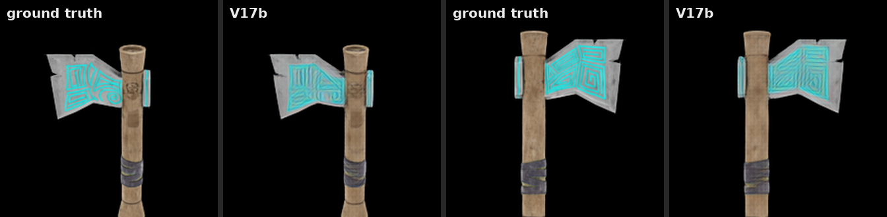
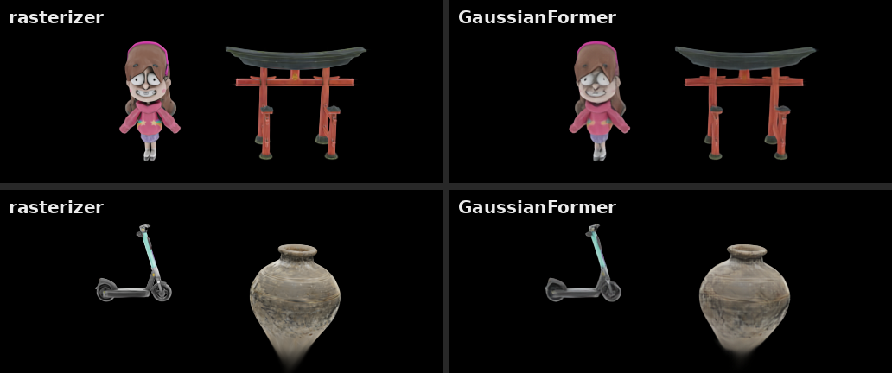

<h1 align="center">GaussianFormer: Transformer Rendering of 3D Gaussian Splats</h1>

<p align="center">
  <a href="https://huggingface.co/shahafvl/gaussianformer-v17b"><strong>Pretrained model</strong></a>
  ·
  <a href="https://github.com/microsoft/renderformer"><strong>RenderFormer (parent project)</strong></a>
</p>

GaussianFormer renders 3D Gaussian Splatting scenes with a transformer, without per-scene optimization. It adapts
[RenderFormer](https://github.com/microsoft/renderformer) (SIGGRAPH 2025), a transformer renderer for triangle
meshes: each Gaussian becomes one scene token, and the two-stage architecture is warm-started from RenderFormer's
pretrained weights.

<div align="center">
  
  <em>GaussianFormer-V17b on an object held out from training, two views.</em>
</div>

<div align="center">
  
  <em>Two objects composed into one scene (40k Gaussians; every training scene holds a single object), rendered by
  a model from the current architecture line trained on these objects. The rasterizer renders the same Gaussians.</em>
</div>

## Status

- **Released:** `shahafvl/gaussianformer-v17b`, trained on 13,405 objects. On 1,806 held-out objects it reaches
  30.3 dB PSNR (object crop, vs. the full splat), against 44.9 dB for rasterizing the same input.
- **In progress:** a full-data run of the current architecture (projected 2-D RoPE, windowed cross-attention, 4 px
  ray patches, multi-distance training views) on 26,820 objects. It will replace V17b when evaluated.

## Installation

```bash
uv sync
uv run python -c "import imageio; imageio.plugins.freeimage.download()"  # HDR I/O
```

Flash Attention is optional; without it the code uses PyTorch SDPA (force with `ATTN_IMPL=sdpa`). The windowed
cross-attention needs Flash Attention on GPU.

## Rendering

```bash
uv run python infer_gaussian.py --h5_file scene.h5 --output_dir out/   # model defaults to gaussianformer-v17b
```

```python
import torch
from gaussianformer.pipelines.rendering_pipeline import GaussianFormerRenderingPipeline

pipeline = GaussianFormerRenderingPipeline.from_pretrained("shahafvl/gaussianformer-v17b")
pipeline.to(torch.device("cuda"))
# gaussians [B, N, 14] = pos(3) | scale(3) | quat wxyz(4) | rgb(3) | opacity(1); mask [B, N] bool
# c2w [B, V, 4, 4] (Blender convention: -Z forward, +Y up); fov [B, V, 1] in degrees
imgs = pipeline(gaussians=g, mask=m, c2w=c2w, fov=fov, resolution=512, torch_dtype=torch.float16)
# imgs [B, V, 512, 512, 3], linear HDR
```

An input scene is an HDF5 file with `means [N,3]`, `scales [N,3]`, `rotations [N,4]` (w,x,y,z), `colors [N,3]`,
`opacities [N,1]`, `c2w [V,4,4]` and `fov [V]`. The models are trained on single objects inside [-0.45, 0.45]³,
cameras at distance ~1.7 with a 45° field of view, and about 20k Gaussians per object.

## Model

| Stage | Input | Role |
|---|---|---|
| Scene encoder | one token per Gaussian (Linear over its 14 parameters), 3-D RoPE on positions | 12-layer transformer over the whole splat, view-independent |
| View decoder | one token per image patch (ray directions) | 6 layers of self-attention between patches and cross-attention to the scene tokens, then a DPT head to pixels |

The current architecture adds, all as options in `GaussianFormerConfig` (`gaussianformer/models/config.py`). The
last two live on the development branch [`v20/placement`](https://github.com/SVLwoof/gaussianformer/tree/v20/placement)
until it is merged:

- `proj_rope_2d`: each Gaussian is projected into the view, and its image coordinates enter the cross-attention as a
  2-D RoPE matched against each patch's position.
- `xattn_window`: each image tile attends only to the Gaussians whose projected footprint reaches it
  (`gaussianformer/layers/window.py`), which makes finer patch grids affordable.
- `patch_size=4` with `ray_embed_patch=8`: a 4 px patch grid that reuses the pretrained 8 px ray embedding.

## Data and training

| Step | Script |
|---|---|
| Download [Objaverse_Splats](https://huggingface.co/datasets/ShapeSplats/Objaverse_Splats), normalize, render ground truth from the full splat | `data_v10/process_full.py` |
| Prune each object to 20k Gaussians and fine-tune the kept ones (LightGaussian score + recovery) | `data_v10/prune_recovery.py` |
| Add views at camera distances 1.15 and 2.45 | `data_v10/multi_radius_full.py` (`v20/placement`) |
| Training, released models (two phases, cosine LR) | `training/train.py` |
| Training, current full-data run (warmup-stable-decay LR, resumable, 8 GPUs) | `training/train_full.py`, `data_v10/train_full.sh` (`v20/placement`) |
| Per-object LoRA adapters | `training/train_lora.py` |
| Held-out evaluation against the full splat and the rasterized input | `data_v10/ceiling_eval.py` |

The loss is log-HDR L1 plus LPIPS-VGG (0.5 each); the current recipe also down-weights background pixels in the L1
term. SLURM scripts assume HUJI's `lmod` layout.

## Acknowledgements

Built on [RenderFormer](https://github.com/microsoft/renderformer) by Chong Zeng, Yue Dong, Pieter Peers, Hongzhi Wu
and Xin Tong (SIGGRAPH 2025), whose architecture, attention layers, DPT decoder and inference code form the backbone
of this project. Training data is the Objaverse_Splats subset of [Objaverse](https://objaverse.allenai.org/). Pruning
follows [LightGaussian](https://github.com/VITA-Group/LightGaussian); ground truth is rendered with
[gsplat](https://github.com/nerfstudio-project/gsplat).

## License

- **Code:** MIT (inherits RenderFormer).
- **Weights:** CC-BY-NC-4.0, inheriting the non-commercial terms of the Objaverse_Splats training data.

## Citation

Please cite RenderFormer:

```bibtex
@inproceedings{zeng2025renderformer,
  title     = {RenderFormer: Transformer-based Neural Rendering of Triangle Meshes with Global Illumination},
  author    = {Chong Zeng and Yue Dong and Pieter Peers and Hongzhi Wu and Xin Tong},
  booktitle = {ACM SIGGRAPH 2025 Conference Papers},
  year      = {2025}
}
```
