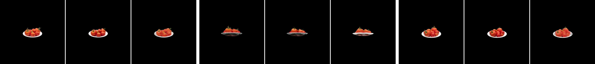
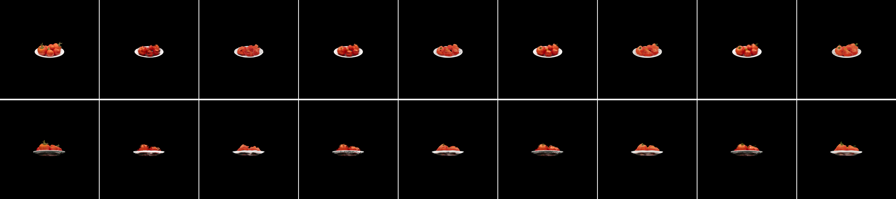

<h1 align="center">GaussianFormer: Adapting RenderFormer to Render 3D Gaussian Splats</h1>

<p align="center">
  <a href="https://huggingface.co/shahafvl/gaussianformer-v10b"><strong>Pretrained Model</strong></a>
  ·
  <a href="https://github.com/microsoft/renderformer"><strong>Parent Project (RenderFormer)</strong></a>
</p>

GaussianFormer is a proof-of-concept neural renderer that takes a 3D Gaussian
Splatting scene as input and synthesizes novel views without per-scene
optimization at inference time. It adapts
[RenderFormer](https://github.com/microsoft/renderformer) (SIGGRAPH 2025) — a
transformer-based neural renderer designed for triangle meshes — by replacing
its mesh input encoder with a Gaussian-native module that maps each Gaussian's
14-dimensional parameter vector to a scene token. The two-stage transformer
(view-independent scene encoder + view-dependent ray decoder) is otherwise
unchanged.

<div align="center">
  
  <em>Tomatoes scene (real-world 3DGS scan), 14-view orbit, N=30k input
  Gaussians: full gsplat (left), pruned gsplat used as input (middle),
  GaussianFormer V10b output (right).</em>
</div>

# Pretrained model

| Model | Params | Link | Model ID |
|-------|--------|------|----------|
| GaussianFormer-V10b | 195M | [Hugging Face](https://huggingface.co/shahafvl/gaussianformer-v10b) | `shahafvl/gaussianformer-v10b` |

V10b epoch 26 is an LPIPS-VGG perceptual fine-tune of the V9 epoch 60 base.
Weights are downloaded automatically by `from_pretrained`.

# Installation

We use [`uv`](https://github.com/astral-sh/uv) to manage dependencies. From a
clone of the repo:

```bash
uv sync
uv run python -c "import imageio; imageio.plugins.freeimage.download()"  # for HDR I/O
```

Flash Attention is optional; the code falls back to PyTorch SDPA automatically.
To force SDPA: `ATTN_IMPL=sdpa`.

If you prefer plain pip: `pip install -r requirements.txt` works against the
same `pyproject.toml` deps.

# Quickstart: render a Gaussian scene

End-to-end CLI inference, downloading weights from the Hub on first run:

```bash
uv run python infer_gaussian.py \
  --h5_file gaussian_training_h5s/scene_0000.h5 \
  --model_id shahafvl/gaussianformer-v10b \
  --output_dir output/quickstart
```

Output: one EXR (linear HDR) and one PNG (LDR) per camera view in the H5.

Programmatic use:

```python
import torch
from gaussianformer.pipelines.rendering_pipeline import GaussianFormerRenderingPipeline

pipeline = GaussianFormerRenderingPipeline.from_pretrained("shahafvl/gaussianformer-v10b")
pipeline.to(torch.device("cuda"))

# gaussians: [B, N, 14]   (pos[3] | scale[3] | quat[4] | rgb[3] | opacity[1])
# mask:      [B, N]       boolean
# c2w:       [B, V, 4, 4] camera-to-world (Blender convention)
# fov:       [B, V, 1]    field of view in degrees
imgs = pipeline(gaussians=g, mask=m, c2w=c2w, fov=fov,
                resolution=512, torch_dtype=torch.float16)
# imgs: [B, V, H, W, 3], linear HDR
```

The `infer_gaussian.py` script wraps this and adds tone mapping + EXR/PNG output.

# Pipeline overview

```
Scene JSON descriptor
  │
  │── (mesh route, RenderFormer)
  │     scene_processor/convert_scene.py  → triangle H5
  │     infer.py                           → render
  │
  └── (Gaussian route, this project)
        batch_convert_to_gaussian_examples.py   → Gaussian PLY + JSON
        gaussian_scene_processor/batch_generate_h5.py   → Gaussian H5
        infer_gaussian.py                               → render
```

Both routes share the same architecture. The Gaussian route swaps in
`gaussianformer/`'s input encoder; the rest of the pipeline (encodings, layers,
view transformer, DPT decoder) is shared structure with RenderFormer.

The HDF5 fields for a Gaussian scene:

- `means [N, 3]`, `scales [N, 3]`, `rotations [N, 4]` (w,x,y,z), `colors [N, 3]`,
  `opacities [N, 1]`
- `c2w [V, 4, 4]`, `fov [V]` — camera convention is Blender (-Z view, +Y up,
  +X right).

# Training

Training was done in two phases:

1. **Phase A — Objaverse_Splats pretrain (V9).** Single-object 3DGS scans from
   [Objaverse_Splats](https://huggingface.co/datasets/ShapeSplats/Objaverse_Splats)
   (2,667 train / 183 val), pure log-HDR L1 loss, 60 epochs on 3 GPUs.

   ```bash
   # Build the train/val splits and process the source PLYs into HDF5s
   uv run python data_v9/build_object_list.py
   sbatch runs/process_objaverse_v9.sh
   # Train
   sbatch runs/train_phase2_v9.sh
   ```

   The committed `data_v9/object_list_{train,val}.json` and
   `data_v9/metadata_{train,val}.json` pin the exact split.

2. **Phase B — LPIPS perceptual fine-tune (V10b).** Combined log-HDR L1 +
   LPIPS-VGG (weight 0.2) on tonemapped LDR output, fine-tuned from V9 ep60,
   26 epochs on 4 GPUs (cosine LR 5e-5 → 5e-7, batch size 4).

   ```bash
   sbatch runs/train_phase2_v10b.sh
   ```

The SLURM scripts assume HUJI's `lmod` layout but are portable via the
`LMOD_INIT` env var (see `.env.example`). To reproduce on another cluster, set
`LMOD_INIT=/path/to/your/lmod.sh` and add a `--mail-user` line to the
SBATCH header if you want job notifications.

# Headline results

PSNR (dB, vs full-gsplat ground truth) on the *Tomatoes* real-world scan
across token budgets:

| Model            | N=5k  | N=10k | N=20k | N=30k |
|------------------|-------|-------|-------|-------|
| V6 (multi-obj)   | 21.78 | 21.95 | 22.54 | 23.00 |
| V9 ep60 (L1)     | 25.90 | 26.94 | 27.74 | 28.24 |
| **V10b ep26**    | 25.80 | 26.70 | 27.41 | 27.81 |

<div align="center">
  
  <em>V10b ep26 on Tomatoes across N=5k/10k/20k/30k input Gaussians; full
  gsplat reference at far right.</em>
</div>

# Limitations

- **Data is the lever.** The +4 dB jump between V6 and V9 came from switching
  from synthetic multi-object Cornell-box scenes to single-object Objaverse
  3DGS scans. Loss tweaks and token-budget bumps were near-zero deltas.
- **N matters less than scene quality.** Going from N=5k to N=30k tokens at
  V9 ep60 buys +2.3 dB — real, but small compared to the data overhaul. The
  model generalizes beyond its 5k training token count, but cleanliness of
  the input distribution matters more.
- **LPIPS skews PSNR.** V10b's ~0.3 dB regression vs V9 ep60 is expected:
  LPIPS gradients optimize feature-space similarity, not pixel fidelity. The
  visual sharpness gain is the goal; PSNR alone undersells perceptual models.
- **Scope.** Trained on isolated single objects with clean backgrounds.
  Multi-object scenes, large-scale captures, and unbounded backgrounds degrade
  significantly. The system still falls short of standard rasterized 3DGS in
  output quality on the Tomatoes evaluation.

# Bring your own scene

<details>
<summary>HDF5 schema and JSON descriptor</summary>

A Gaussian scene HDF5 contains:

- `means [N, 3]`, `scales [N, 3]`, `rotations [N, 4]` (quaternion w,x,y,z),
  `colors [N, 3]`, `opacities [N, 1]`
- `c2w [V, 4, 4]`, `fov [V]` — Blender camera convention.

To go from a `.ply` + JSON descriptor to an HDF5, see
`gaussian_scene_processor/batch_generate_h5.py`. The JSON descriptor format
(v1.1-gaussian) is similar to RenderFormer's v1.0 mesh format but with
quaternion rotations and a simplified material (`color_tint`,
`opacity_multiplier`). For the full mesh-side JSON spec, see the upstream
[RenderFormer README](https://github.com/microsoft/renderformer#bring-your-own-scene).

Stay within the original RenderFormer training-data ranges for best results:
camera distance to scene center 1.5–2.0 m, FOV 30°–60°, scene bounding box
[-0.5, 0.5]³.

</details>

# Acknowledgements

This work is built directly on top of
[**RenderFormer**](https://github.com/microsoft/renderformer) by Chong Zeng,
Yue Dong, Pieter Peers, Hongzhi Wu, and Xin Tong (SIGGRAPH 2025). Its
two-stage architecture, attention layers, DPT decoder, scene-conversion
tooling, and inference code form the backbone of this project. Asset
attributions for the example meshes are listed in the
[upstream README](https://github.com/microsoft/renderformer#acknowledgements).

Training data is the [Objaverse_Splats](https://huggingface.co/datasets/ShapeSplats/Objaverse_Splats)
subset of [Objaverse](https://objaverse.allenai.org/). Importance-based
Gaussian pruning follows
[LightGaussian](https://github.com/VITA-Group/LightGaussian).

# License

- **Code**: MIT (inherits RenderFormer).
- **Pretrained weights** (`shahafvl/gaussianformer-v10b`): CC-BY-NC-4.0,
  inheriting the non-commercial restriction of the Objaverse_Splats training
  data. Research / non-commercial use only.

# Citation

GaussianFormer is built on RenderFormer; if you use it in academic work,
please cite the original paper:

```bibtex
@inproceedings{zeng2025renderformer,
  title     = {RenderFormer: Transformer-based Neural Rendering of Triangle Meshes with Global Illumination},
  author    = {Chong Zeng and Yue Dong and Pieter Peers and Hongzhi Wu and Xin Tong},
  booktitle = {ACM SIGGRAPH 2025 Conference Papers},
  year      = {2025}
}
```

The GaussianFormer adaptation, training pipeline, and pretrained checkpoint
are documented at
[github.com/SVLwoof/gaussianformer](https://github.com/SVLwoof/gaussianformer).
