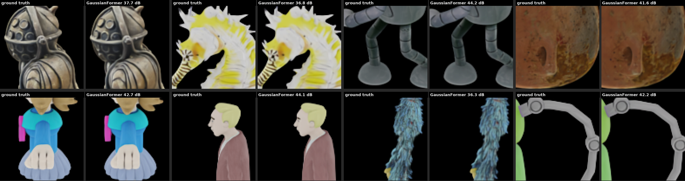
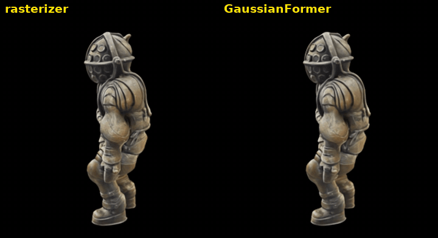
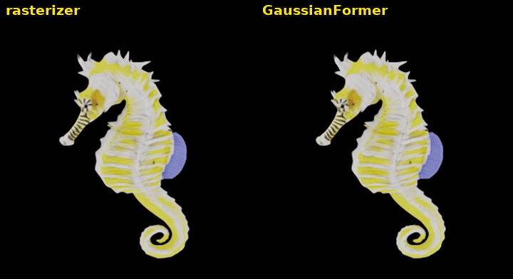
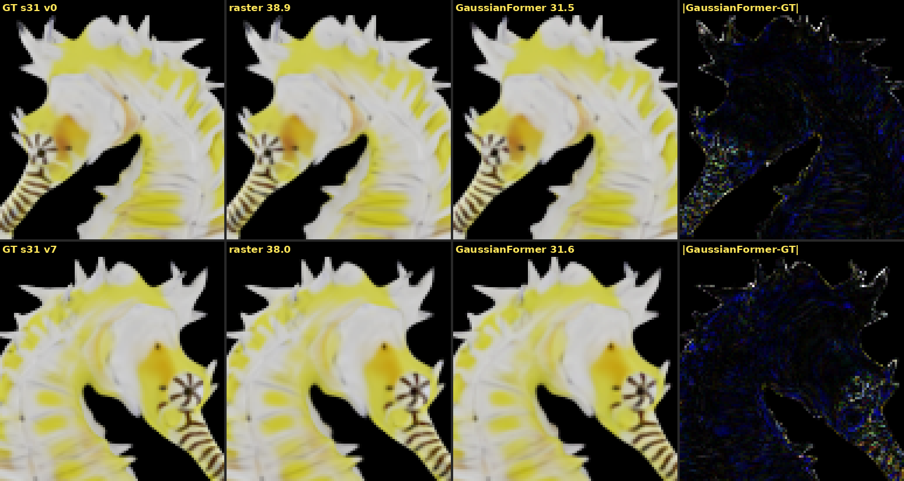

<h1 align="center">GaussianFormer: Transformer Rendering of 3D Gaussian Splats</h1>

<p align="center">
  <a href="https://huggingface.co/shahafvl/gaussianformer"><strong>Pretrained model</strong></a>
  ·
  <a href="https://huggingface.co/collections/shahafvl/gaussianformer-6abb727b461d7c89d5308f1c"><strong>All checkpoints</strong></a>
  ·
  <a href="https://github.com/microsoft/renderformer"><strong>RenderFormer</strong></a>
</p>

GaussianFormer renders 3D Gaussian Splatting scenes with a transformer, without per-scene optimization. It adapts
[RenderFormer](https://github.com/microsoft/renderformer) (SIGGRAPH 2025), a transformer renderer for triangle
meshes: each Gaussian becomes one scene token, and the two-stage architecture is warm-started from RenderFormer's
pretrained weights.

<div align="center">
  
  <em>Eight objects never seen in training: ground truth (full splat) and GaussianFormer, PSNR per view.</em>
</div>

<div align="center">
  
  
  <em>Two held-out objects, rasterized (left) and rendered by GaussianFormer (right): a camera orbit and a tumbling
  object.</em>
</div>

<div align="center">
  
  <em>A held-out object up close: ground truth, rasterization of the 20k-Gaussian input, GaussianFormer, and its
  absolute error.</em>
</div>

## Results

300 objects held out from training, 4 views each (views 0, 4, 7 and 11 at distance 1.7), PSNR on the object's
bounding box against the full-splat ground truth:

| | PSNR (dB) |
|---|---|
| gsplat rasterization of the same 20k-Gaussian input | 44.97 |
| **GaussianFormer** | **37.08** |

Closer in (distance 1.15, the same four angles), GaussianFormer scores 36.87 dB against 42.24 dB for rasterization.
On 300 training objects it scores 37.19 dB: seen and unseen objects differ by 0.07 dB.

## Installation

```bash
uv sync
```

Linux with an NVIDIA GPU. The lockfile installs PyTorch 2.9 (CUDA 12.8) and a prebuilt Flash Attention 2 wheel,
which the windowed cross-attention needs; gsplat compiles its CUDA kernels on first use.

## Rendering

```bash
uv run python infer.py --h5 scene.h5 --out renders/
```

```python
import torch
from gaussianformer import GaussianFormerRenderingPipeline

pipeline = GaussianFormerRenderingPipeline.from_pretrained("shahafvl/gaussianformer").to(torch.device("cuda"))
# gaussians [B, N, 14] = pos(3) | scale(3) | quat wxyz(4) | rgb(3) | opacity(1); mask [B, N] bool
# c2w [B, V, 4, 4] camera-to-world (-Z forward, +Y up); fov [B, V] in degrees
images = pipeline(gaussians, mask, c2w, fov, resolution=512)  # [B, V, 512, 512, 3]
```

A scene is an HDF5 file with `means [N,3]`, `scales [N,3]`, `rotations [N,4]` (w,x,y,z), `colors [N,3]`,
`opacities [N,1]`, `c2w [V,4,4]` and `fov [V]`. The model is trained on single objects scaled into
[-0.45, 0.45]³, about 20k Gaussians each, seen from 1.15 to 2.45 units away with a 45° field of view. Colors are
view-independent.

## Model

| Stage | Tokens | Layers |
|---|---|---|
| Scene encoder | one per Gaussian (a linear map of its 14 parameters), plus 16 registers; 3-D RoPE on positions | 12 self-attention layers, view-independent |
| View decoder | one per 4×4-pixel patch, from its ray directions | 6 layers of cross-attention to the scene tokens and patch self-attention, then a DPT head |

Changes over RenderFormer besides the input tokens (options in `gaussianformer/models/config.py`):

- `proj_rope_2d`: each Gaussian is projected into the view, and its image position enters the cross-attention as a
  2-D RoPE matched against each patch's position.
- `xattn_window`: each 8×8-patch tile attends only to the Gaussians whose projected footprint reaches it
  (`gaussianformer/layers/window.py`), which makes the finer patch grid affordable.
- `patch_size=4` with `ray_embed_patch=8`: 4 px patches (RenderFormer: 8 px) that reuse the pretrained 8 px ray
  embedding.

## Data

```bash
scripts/prepare_data.sh
```

For each object of [Objaverse_Splats](https://huggingface.co/datasets/ShapeSplats/Objaverse_Splats) listed in
`data/splits/` (`data/prepare.py`):

1. Normalize the splat and render 28 ground-truth views of it with gsplat: 14 at distance 1.7, 7 each at 1.15 and
   2.45.
2. Keep its 20k most important Gaussians ([LightGaussian](https://github.com/VITA-Group/LightGaussian) score) and
   fine-tune them to match the full splat.

The result is `data/{train,val}/h5s/scene_*.h5` (inputs and cameras) and `data/{train,val}/renders/` (targets):
26,820 training and 1,806 validation objects.

## Training

```bash
scripts/train.sh
```

`training/train.py` is a data-parallel trainer with a warmup-stable-decay learning rate that resumes from its newest
checkpoint. The released model is trained in four stages on 8 GPUs:

| Stage | Resolution | Trains | Steps | Loss |
|---|---|---|---|---|
| 1 | 256 | Gaussian input head, RenderFormer backbone frozen | 33.5k | log L1 |
| 2 | 256 | everything | 402k | log L1 |
| 3 | 256 | everything, with the three changes above switched on | 3k | log L1 |
| 4 | 512 | everything | 385k | log L1 + LPIPS |

The log-L1 term compares log10(image + 1) and weights background pixels by 0.05 from stage 3 on.

## Evaluation

```bash
uv run python evaluate.py --data data/val --objects data/splits/heldout300.json
uv run python -m tests.test_model   # CPU tests
```

## Acknowledgements

Built on [RenderFormer](https://github.com/microsoft/renderformer) by Chong Zeng, Yue Dong, Pieter Peers, Hongzhi Wu
and Xin Tong, whose architecture, attention layers and DPT decoder form the backbone of this project. The training
data is the Objaverse_Splats subset of [Objaverse](https://objaverse.allenai.org/); ground truth is rendered with
[gsplat](https://github.com/nerfstudio-project/gsplat).

## License

- **Code:** MIT.
- **Weights:** CC-BY-NC-4.0, following the non-commercial terms of the Objaverse_Splats training data.

## Citation

A paper on GaussianFormer is in preparation and will be presented at a later date; its citation will be added here.

GaussianFormer builds on RenderFormer; please also cite:

```bibtex
@inproceedings{zeng2025renderformer,
  title     = {RenderFormer: Transformer-based Neural Rendering of Triangle Meshes with Global Illumination},
  author    = {Chong Zeng and Yue Dong and Pieter Peers and Hongzhi Wu and Xin Tong},
  booktitle = {ACM SIGGRAPH 2025 Conference Papers},
  year      = {2025}
}
```
